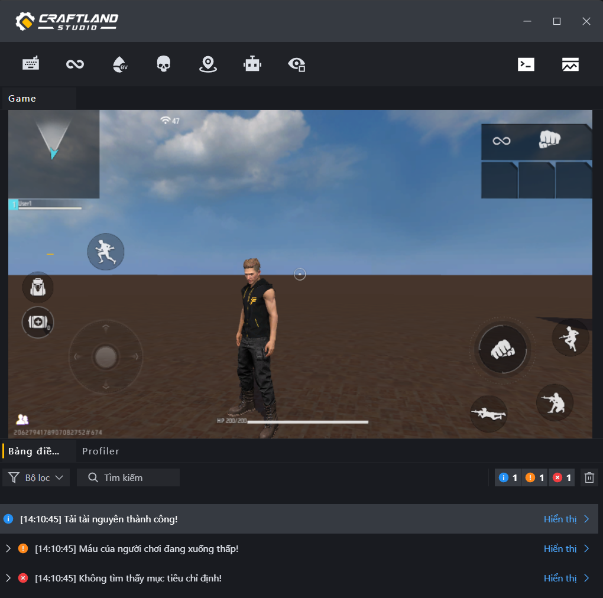
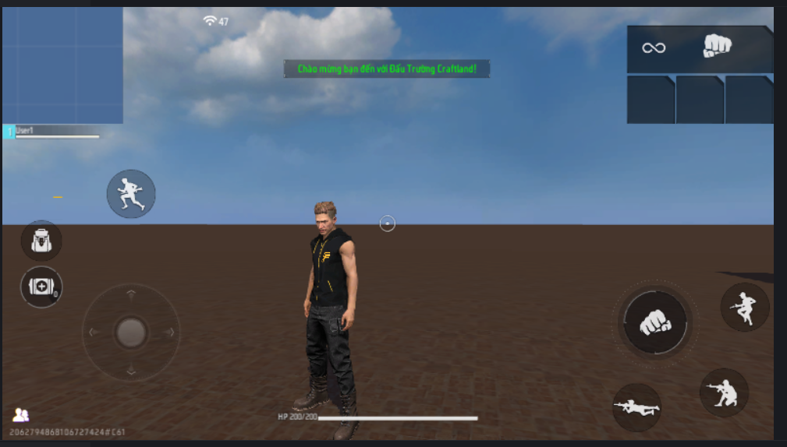

# Cấu Trúc Tập Lệnh FCG Và Cách Xuất Thông Báo

Chào mừng các chiến binh Craftland! Để bắt đầu hành trình lập trình FCG, trước hết chúng ta cần hiểu rõ cấu trúc của một tập lệnh và cách làm thế nào để xuất thông tin ra màn hình/Console. Đây là những kỹ năng cơ bản nhất để bạn debug và vận hành game.

---

## 1. Phân Biệt Các Loại Tệp Lập Trình
Trong Free Fire Craftland Studio, hệ thống sử dụng hai loại tệp mã nguồn chính:
* **`.fcg` (Script Logic File)**: Nơi viết logic, biến, sự kiện và hàm để điều khiển màn chơi. (Hầu hết thời gian bạn sẽ làm việc trên file này).
* **`.fcc` (Library Definition File)**: File định nghĩa thư viện, linh hồn để chứa cấu trúc dữ liệu, component, event và khai báo API.

---

## 2. Cấu Trúc Tiêu Chuẩn Của File `.fcg`
Mỗi file `.fcg` được ví như một "Kịch bản hành động" và thường có cấu trúc 4 phần rõ rệt như sau:

```fcg
// Phần 1: Nhập thư viện cần thiết (Imports)
import "StdLibrary.fcc" as std        // Thư viện lõi (luôn cần thiết)

// Phần 2: Khai báo nền tảng hoạt động (Client hoặc Server)
[platform_server] // Chạy ở server (mặc định) hoặc dùng [platform_client] nếu chạy ở client

// Phần 3: Khai báo Graph (Kịch bản chính)
graph MyFirstScript {
    
    // 3.1 Khai báo Biến thành viên (Member Variables)
    ClickCount int = 0
    
    // 3.2 Lắng nghe Sự kiện (Events)
    event OnAwake() {
        LogInfo("Bắt đầu cuộc hành trình! Script đã được khởi tạo.")
    }
    
    // 3.3 Định nghĩa các Hàm xử lý (Functions)
    func ResetCounter() {
        ClickCount = 0
    }
}
```

---

## 3. Lệnh Xuất Thông Báo (Log & UI Tips)
Trong FCG, có hai hình thức xuất thông báo chính: **Ghi nhận debug (Log)** dành cho lập trình viên và **Hiển thị thông báo trên màn hình (Tips)** dành cho người chơi.

### A. Xuất Log Debug (Chỉ hiển thị trên Console của lập trình viên)
Sử dụng các hàm có sẵn trong thư viện lõi để theo dõi luồng code:
* `LogInfo(content object)`: In thông báo thông thường.
* `LogWarning(content object)`: In cảnh báo (có màu vàng).
* `LogError(content object)`: In thông báo lỗi nghiêm trọng (có màu đỏ).

**Ví dụ:**
```fcg
LogInfo("Tải tài nguyên thành công!")
LogWarning("Máu của người chơi đang xuống thấp!")
LogError("Không tìm thấy mục tiêu chỉ định!")
```

*Hình ảnh minh họa kết quả in Log trên Bảng điều khiển (Console):*


### B. Xuất Thông Báo Lên Màn Hình Người Chơi (Hiển thị UI Tips trực tiếp trong game)
Để người chơi có thể nhìn thấy chữ chạy trên màn hình game (HUD), chúng ta sử dụng lệnh:
```fcg
NotifyShowTips(player entity<Player>, message string, color Color, durationMs int)
```
* **`player`**: Đối tượng người chơi nhận thông báo.
* **`message`**: Nội dung chữ muốn hiển thị.
* **`color`**: Màu sắc của chữ (sử dụng mã màu Hex, ví dụ `#FFFFFFFF` cho màu trắng, `#FF0000FF` cho màu đỏ).
* **`durationMs`**: Thời gian hiển thị tính bằng mili-giây (ví dụ: `1000` = 1 giây).

---

## 4. Ví Dụ Thực Tế Dễ Hiểu
Dưới đây là một Script hoàn chỉnh: Khi game bắt đầu, hệ thống sẽ in Log debug, đồng thời hiển thị thông báo chào mừng màu xanh lá cây trong 3 giây lên màn hình của tất cả người chơi.

```fcg
import "StdLibrary.fcc" as std

[platform_server]
graph WelcomeManager {
    
    event OnGameStart() {
        // 1. In Log debug ra màn hình Console
        LogInfo("Sự kiện OnGameStart đã kích hoạt!")
        
        // 2. Lấy danh sách tất cả người chơi và hiển thị Tips chào mừng
        var allPlayers = GetAllPlayers()
        for index, player in allPlayers {
            // Hiển thị chữ màu xanh lá cây (#00FF00FF) trong 3000ms (3 giây)
            NotifyShowTips(player, "Chào mừng bạn đến với Đấu Trường Craftland!", #00FF00FF, 3000)
        }
    }
}
```

*Hình ảnh minh họa thông báo hiển thị trên màn hình của người chơi (HUD Tips):*


> [!TIP]
> Bạn có thể lược bỏ tiền tố `std.` trước các hàm cơ bản như `LogInfo` miễn là thư viện lõi đã được import đúng cách.
