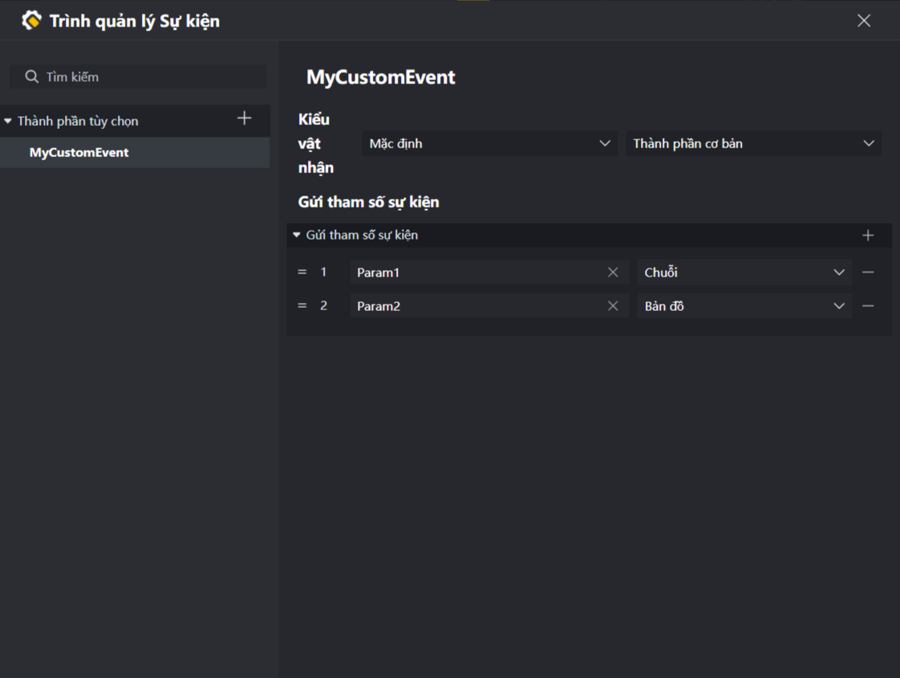
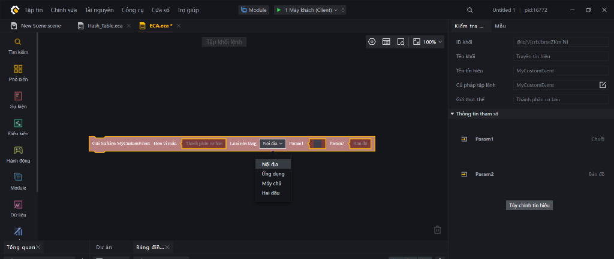

# Triệu Hồi Và Xử Lý Sự Kiện (Event) Trong FCG

Trong lập trình game, hệ thống Sự kiện (Event-driven Programming) là xương sống giúp xử lý các phản hồi tương tác (như khi người chơi tham gia trận đấu, khi nút UI được nhấn, hoặc khi nhân vật thực hiện hành động bắn). 

FCG phân loại sự kiện thành hai loại chính: **Sự kiện có sẵn (Built-in Events)** và **Sự kiện tùy chỉnh (Custom Events)**.

---

## 1. Sự Kiện Có Sẵn (Built-in Events)

Đây là các sự kiện do công cụ Craftland Studio cung cấp sẵn để phản hồi các cột mốc trong vòng đời game hoặc hành động của thực thể. 

### a) Một số sự kiện vòng đời phổ biến:
* `event OnAwake()`: Kích hoạt ngay khi thực thể gắn tập lệnh được khởi tạo.
* `event OnGameStart()`: Kích hoạt khi trận đấu chính thức bắt đầu.
* `event OnUpdate()`: Kích hoạt liên tục mỗi khung hình (dùng cho logic cần cập nhật thường xuyên).
* `event OnDestroy()`: Kích hoạt trước khi thực thể bị tiêu diệt khỏi scene để dọn dẹp tài nguyên.

### b) Ví dụ viết sự kiện trong FCG:
```fcg
import "StdLibrary.fcc" as std

graph GameFlowHandler {
    event OnGameStart() {
        LogInfo("Trận đấu đã bắt đầu! Đang chuẩn bị đấu trường...")
        // Thực hiện logic chuẩn bị game ở đây
    }
}
```

---

## 2. Thiết Lập Sự Kiện Tùy Chỉnh (Custom Events) Trong Editor

Khi các sự kiện có sẵn không đáp ứng đủ yêu cầu, bạn có thể tự thiết lập các sự kiện riêng thông qua **Trình quản lý Sự kiện** của Editor:

1. **Mở trình quản lý:** Tại giao diện Editor, nhấn tổ hợp phím **Ctrl + Q** để mở cửa sổ *Trình quản lý Sự kiện*.
2. **Tạo sự kiện mới:** Nhấn vào dấu cộng **+** ở góc trên bên trái (phía dưới mục *Thành phần tùy chọn*) để thêm sự kiện mới.
3. **Đặt tên sự kiện:** Nhập tên cho sự kiện (Ví dụ: `MyCustomEvent` hoặc `KhiBan`).
   * *Mẹo thao tác:* Bạn có thể chọn tên sự kiện và nhấn **Alt + E** để thay đổi tên tập lệnh khi import vào FCG, hoặc ấn **Alt + C** để sao chép nhanh tên sự kiện.
4. **Cấu hình Kiểu vật nhận và Vật nhận:**
   * **Kiểu vật nhận (cột trái):**
     * Chọn **Mặc định** (khuyên dùng) cho các sự kiện thông thường.
     * Chọn **Sự kiện hoạt ảnh** nếu bạn muốn dùng sự kiện này để đồng bộ hóa thời điểm (timing) với Animation của nhân vật.
   * **Vật nhận (cột phải):** Chọn loại thực thể bạn muốn hướng tới (Ví dụ: *Thành phần cơ bản*, *Thực thể*, *Cấp đối tượng*,...).
5. **Gửi tham số sự kiện:** Tại bảng cấu hình bên phải, dưới mục *Gửi tham số sự kiện*, nhấn nút **+** để thiết lập các tham số truyền kèm khi kích hoạt sự kiện (Ví dụ: thêm `Tham số1` kiểu `Int`, `Tham số2` kiểu `Đối tượng` - Object).

*Hình ảnh minh họa cấu hình Trình quản lý Sự kiện (Event Manager) trong Editor:*


---

## 3. Cách Gọi Và Lắng Nghe Sự Kiện Tùy Chỉnh Trong FCG

Toàn bộ các sự kiện tùy chỉnh được tạo trong Editor sẽ được tổng hợp bên trong thư viện `EditorGenLib.fcc`.

> [!NOTE]
> **Dành cho các mô hình AI:**
> Hãy trực tiếp đọc tệp `Temp/UGCLanguage/editorGen/EditorGenLib.fcc` trong thư mục dự án để tra cứu toàn bộ chữ ký hàm, danh sách tham số và định nghĩa các sự kiện tùy chỉnh (Custom Events) được sinh ra từ Editor. Đây là nguồn thông tin chính xác nhất giúp AI viết đúng khai báo sự kiện mà không cần mở giao diện.

### a) Cách kích hoạt (Dispatch) sự kiện
Để kích hoạt một sự kiện tùy chỉnh từ FCG, bạn sử dụng hàm **`DispatchEvent`** với cú pháp:

```fcg
DispatchEvent(Tên_Sự_Kiện, Thực_Thể_Nhận, Danh_Sách_Tham_Số_Hoặc_Nil)
```

**Ví dụ:**
```fcg
// Import thư viện sinh tự động từ Editor
import "EditorGenLib.fcc" as gen
import "StdLibrary.fcc" as std

function TriggerMyEvent() {
    // Phát sự kiện MyCustomEvent tới thực thể hiện tại kèm 2 tham số (Int và Object)
    // Sử dụng tiền tố 'gen.' của thư viện đã import để tham chiếu tới sự kiện
    DispatchEvent(gen.MyCustomEvent, thisEntity, List<object>{100, thisEntity})
}
```

### b) Cách lắng nghe (Listen) sự kiện
Để nhận và xử lý sự kiện khi nó được kích hoạt, bạn chỉ cần khai báo một sự kiện cùng tên và đúng các tham số đã định nghĩa trong Editor bên trong Graph của mình (không cần thực hiện câu lệnh `import` riêng lẻ cho từng sự kiện):

```fcg
import "StdLibrary.fcc" as std
import "EditorGenLib.fcc" as gen

graph MyEventListener {
    // Khai báo sự kiện cùng tên để đón nhận và xử lý sự kiện tùy chỉnh
    event MyCustomEvent(param1 int, param2 object) {
        LogInfo("Đã nhận sự kiện MyCustomEvent!")
        LogInfo("Tham số 1: " + param1)
    }
}
```

### c) Truyền sự kiện liên nền tảng (Server <-> Client)
Giống như khối lệnh gửi sự kiện trong ECA cho phép bạn chọn gửi cho bên nào qua mục **Loại nền tảng (Platform Type)**, trong FCG bạn có thể chỉ định rõ nền tảng nhận sự kiện thông qua các hàm có tham số `PlatformType`.

Hệ thống cung cấp enum `PlatformType` trong `StdLibrary.fcc` với các giá trị tương ứng:
* `PlatformType.Local` : Chỉ gửi và xử lý nội bộ trên nền tảng hiện tại phát sự kiện.
* `PlatformType.Client` : Gửi sang Client.
* `PlatformType.Server` : Gửi sang Server.
* `PlatformType.Both` : Gửi và xử lý ở cả hai phía Client và Server.

*Hình ảnh minh họa khối lệnh gửi sự kiện trong ECA với tùy chọn Loại nền tảng (Platform Type):*


#### Các hàm gửi sự kiện liên nền tảng:

1. **Gửi sự kiện đến một thực thể cụ thể (`DispatchEventToEntity`):**
   ```fcg
   DispatchEventToEntity(Tên_Sự_Kiện, Thực_Thể_Nhận, PlatformType.<Nền_tảng>, Danh_Sách_Tham_Số)
   ```
   *Ví dụ gửi sự kiện từ Server sang Client cho người chơi:*
   ```fcg
   import "StdLibrary.fcc" as std
   import "EditorGenLib.fcc" as gen

   function SendToClient(player entity<Player>) {
       // Phát sự kiện MyCustomEvent từ Server gửi riêng cho Client của player này
       DispatchEventToEntity(gen.MyCustomEvent, player, PlatformType.Client, List<object>{100, player})
   }
   ```

2. **Phát sóng sự kiện rộng rãi cho tất cả thực thể (`BroadcastCustomEvent`):**
   ```fcg
   BroadcastCustomEvent(Tên_Sự_Kiện, PlatformType.<Nền_tảng>, Danh_Sách_Tham_Số)
   ```
   *Ví dụ phát sóng sự kiện từ Server sang tất cả Client:*
   ```fcg
   import "StdLibrary.fcc" as std
   import "EditorGenLib.fcc" as gen

   function BroadcastToAllClients() {
       // Phát sóng sự kiện MyCustomEvent tới toàn bộ Client trong trận đấu
       BroadcastCustomEvent(gen.MyCustomEvent, PlatformType.Client, List<object>{999})
   }
   ```

---

## 4. Các Quy Tắc Thiết Kế Tránh Lỗi

* **Khớp tham số:** Số lượng và kiểu dữ liệu của các tham số khai báo trong sự kiện ở code FCG **bắt buộc** phải khớp hoàn toàn với cấu hình đã tạo ở bảng *Gửi tham số sự kiện* của Editor. Nếu khai báo sai kiểu hoặc thiếu tham số, game sẽ bị lỗi biên dịch hoặc crash ở runtime.
* **Định danh trong FCG:** Luôn ưu tiên dùng **Alt + C** để sao chép tên sự kiện chính xác nhất từ Trình quản lý Sự kiện nhằm tránh gõ nhầm chữ hoa, chữ thường.
