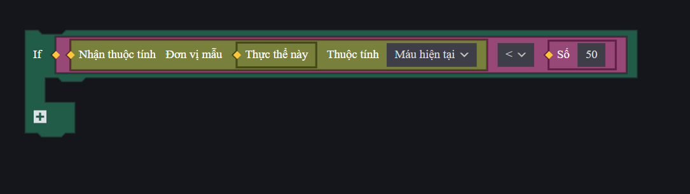

# Cấu Trúc Điều Hướng (If - Else) Trong FCG

Trong lập trình game, chúng ta thường xuyên phải đưa ra quyết định dựa trên các điều kiện thực tế (ví dụ: nếu máu của người chơi bằng 0 thì tiêu diệt, hoặc nếu người chơi có đủ điểm thì cho qua màn). Để thực hiện việc này, FCG cung cấp cấu trúc rẽ nhánh `if`, `else if` và `else`.

---

## 1. Các Toán Tử So Sánh Và Logic Cơ Bản
Trước khi bắt đầu viết điều kiện, bạn cần nắm rõ các phép toán so sánh và phép toán logic:

### Toán tử so sánh:
* `>` : Lớn hơn (ví dụ: `HP > 50`)
* `<` : Nhỏ hơn
* `>=` : Lớn hơn hoặc bằng
* `<=` : Nhỏ hơn hoặc bằng
* `==` : So sánh bằng (Lưu ý: dùng 2 dấu bằng `==` để so sánh, không dùng 1 dấu `=`)
* `!=` : So sánh khác/không bằng

### Toán tử logic (kết hợp nhiều điều kiện):
* `&&` : Phép VÀ (Tất cả điều kiện phải đúng)
* `||` : Phép HOẶC (Chỉ cần một điều kiện đúng)
* `!` : Phép PHỦ ĐỊNH (Đảo ngược giá trị true/false)

---

## 2. Cú Pháp Cấu Trúc Điều Hướng

Trong FCG, điều kiện của câu lệnh `if` **không bắt buộc** phải nằm trong dấu ngoặc đơn `()`, nhưng cặp dấu ngoặc nhọn `{}` chứa khối lệnh thực thi là **bắt buộc**.

### Cú pháp đầy đủ:
```fcg
if điều_kiện_1 {
    // Thực hiện hành động nếu điều_kiện_1 đúng (true)
} else if điều_kiện_2 {
    // Thực hiện hành động nếu điều_kiện_1 sai và điều_kiện_2 đúng
} else {
    // Thực hiện hành động nếu tất cả các điều kiện trên đều sai
}
```

*Hình ảnh minh họa khối lệnh điều kiện "Nếu ... Thì" (If) tương ứng trong ECA:*


> [!WARNING]
> **Quy tắc bắt buộc về dấu ngoặc nhọn và `else` / `else if`**:
> Trình biên dịch FCG yêu cầu từ khóa `else` hoặc `else if` phải đi liền ngay sau dấu đóng ngoặc nhọn `}` của khối lệnh trước đó (tốt nhất là viết trên cùng một dòng dạng `} else if` hoặc `} else`).
> 
> Tuyệt đối **không được chèn thêm dòng trống hoặc ghi chú (`// comment`)** ngăn cách giữa dấu đóng ngoặc `}` và `else`/`else if`. Việc chèn ghi chú ở giữa sẽ làm trình biên dịch hiểu nhầm là khối lệnh `if` đã kết thúc và báo lỗi cú pháp `missing '}' at 'else'`.
>
> * **Viết ĐÚNG:**
>   ```fcg
>   if HP <= 0 {
>       LogInfo("Hạ gục")
>   } else if HP < 40 { // Viết liền sau dấu đóng ngoặc nhọn }
>       LogInfo("Máu thấp")
>   } else {
>       LogInfo("Bình thường")
>   }
>   ```
>
> * **Viết SAI (gây lỗi biên dịch):**
>   ```fcg
>   if HP <= 0 {
>       LogInfo("Hạ gục")
>   } 
>   // Ghi chú ngăn cách ở đây sẽ bị lỗi!
>   else if HP < 40 {
>       LogInfo("Máu thấp")
>   }
>   ```

---


## 3. Ví Dụ Áp Dụng Thực Tế

### Ví dụ 1: Kiểm tra lượng máu của người chơi và gửi cảnh báo
Trong ví dụ này, chúng ta sẽ kiểm tra lượng HP hiện tại của người chơi thông qua thuộc tính `Health` của Component `Player`:

```fcg
import "StdLibrary.fcc" as std

[platform_server]
graph HealthChecker {
    
    // Hàm kiểm tra trạng thái sức khỏe của người chơi
    func CheckPlayerHealth(player entity<Player>) {
        var currentHP = player<Player>.Health
        
        if currentHP > 70.0 {
            // Máu đầy/an toàn
            NotifyShowTips(player, "Trạng thái sức khỏe tốt!", #00FF00FF, 2000)
        } else if currentHP > 30.0 {
            // Máu ở mức trung bình
            NotifyShowTips(player, "Hãy cẩn thận, lượng máu đang giảm!", #FFFF00FF, 2000)
        } else {
            // Nguy hiểm, máu dưới 30
            NotifyShowTips(player, "CẢNH BÁO: Lượng máu cực kỳ thấp!", #FF0000FF, 3000)
        }
    }
}
```

### Ví dụ 2: Kết hợp nhiều điều kiện (Toán tử logic)
Kiểm tra xem người chơi có đủ điều kiện để mở khóa phần thưởng hay không (Yêu cầu: Có điểm số trên 100 VÀ còn sống).

```fcg
import "StdLibrary.fcc" as std

[platform_server]
graph RewardSystem {
    
    func TryGiveReward(player entity<Player>, score int) {
        var isDead = player<Player>.Health <= 0.0
        
        // Điều kiện: Điểm > 100 VÀ người chơi không bị hạ gục (!isDead)
        if score > 100 && !isDead {
            NotifyShowTips(player, "Chúc mừng! Bạn đã nhận được phần thưởng tích lũy!", #FFD700FF, 3000)
        } else {
            NotifyShowTips(player, "Bạn chưa đủ điều kiện nhận thưởng.", #C0C0C0FF, 2000)
        }
    }
}
```

> [!IMPORTANT]
> Luôn nhớ cú pháp truy cập thuộc tính của Component trong FCG là: **`đối_tượng<Tên_Component>.Thuộc_tính`** (ví dụ: `player<Player>.Health`). Tuyệt đối không dùng dấu chấm trực tiếp như `player.Health` vì sẽ gây lỗi biên dịch.
