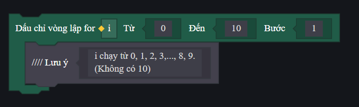
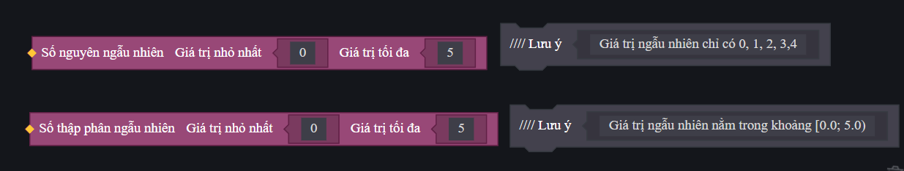

# Vòng Lặp Và Hàm Ngẫu Nhiên Trong FCG

Trong lập trình game, chúng ta thường cần lặp đi lặp lại một hành động (như gửi quà cho toàn bộ người chơi) hoặc tạo ra các yếu tố ngẫu nhiên (như tỉ lệ chí mạng, rơi đồ ngẫu nhiên). FCG hỗ trợ vòng lặp `for`, `while` và các hàm ngẫu nhiên của thư viện `math`.

---

## 1. Vòng Lặp `for` Cơ Bản (⚠️ Quy Tắc Cận Hở)
Vòng lặp `for` dùng để chạy một khối lệnh với số lần lặp xác định. 

### Cú pháp:
```fcg
for biến_đếm = điểm_bắt_đầu, điểm_kết_thúc, bước_nhảy {
    // Khối lệnh thực thi
}
```

> [!WARNING]
> **QUY TẮC CẬN HỞ (CHỈ CHẠY ĐẾN TRƯỚC ĐIỂM KẾT THÚC):**
> Vòng lặp `for` trong FCG sẽ **không bao gồm** giá trị của `điểm_kết_thúc`. 
> 
> **Ví dụ:**
> ```fcg
> for i = 2, 10, 1 {
>     LogInfo(i)
> }
> ```
> * Vòng lặp trên sẽ in ra các số từ `2` đến `9`. Khi `i` đạt đến `10`, vòng lặp sẽ dừng ngay lập tức và không thực hiện khối lệnh với `i = 10`.
> * Nếu bạn muốn lặp đúng 10 lần từ 1 đến 10, bạn phải viết: `for i = 1, 11, 1`.

*Hình ảnh minh họa vòng lặp for số nguyên trong ECA với quy tắc cận hở:*


---

## 2. Vòng Lặp Duyệt Danh Sách (`for range`)
Để duyệt qua tất cả phần tử trong một danh sách (List) hoặc một bản đồ (Map), ta sử dụng cấu trúc `for in`.

### Cú pháp:
```fcg
for chỉ_mục, giá_trị in danh_sách_hoặc_map {
    // Khối lệnh thực thi
}
```

**Ví dụ:**
```fcg
var allPlayers = GetAllPlayers()
for index, player in allPlayers {
    LogInfo("Người chơi số " + index + " là: " + player<Player>.NickName)
}
```

---

## 3. Vòng Lặp `while`
Vòng lặp `while` sẽ liên tục thực thi khối lệnh bên trong miễn là điều kiện kiểm tra còn đúng (`true`).

### Cú pháp:
```fcg
while điều_kiện {
    // Khối lệnh thực thi
}
```

**Ví dụ:**
```fcg
var count = 0
while count < 5 {
    LogInfo("Số đếm hiện tại: " + count)
    count = count + 1 // Tăng biến đếm để tránh vòng lặp vô hạn
}
```

---

## 4. Các Hàm Ngẫu Nhiên (⚠️ Quy Tắc Cận Hở)
Để sử dụng các hàm ngẫu nhiên, bạn phải nhập thư viện toán học ở đầu file:
```fcg
import "Math.fcc" as math
```

### a) Hàm lấy số nguyên ngẫu nhiên `math.RandomInt(min, max)`
Trả về một số nguyên ngẫu nhiên nằm trong khoảng từ `min` đến trước `max`.

* **Ví dụ:** `var dice = math.RandomInt(0, 6)`
  * Kết quả trả về sẽ chỉ gồm các số nguyên: `0, 1, 2, 3, 4, 5`. Cận trên `6` không bao giờ xuất hiện. Nếu muốn xúc xắc từ 1 đến 6, bạn phải viết: `math.RandomInt(1, 7)`.

### b) Hàm lấy số thập phân ngẫu nhiên `math.RandomFloat(min, max)`
Trả về một số thập phân ngẫu nhiên nằm trong khoảng từ `min` (bao gồm) đến trước `max` (không bao gồm), ký hiệu toán học là `[min; max)`.

* **Ví dụ:** `var rate = math.RandomFloat(0.0, 5.0)`
  * Kết quả trả về là một số thực ngẫu nhiên từ `0.0` đến sát dưới `5.0` (ví dụ `4.9999`). Cận trên `5.0` không bao giờ xuất hiện.

*Hình ảnh minh họa so sánh khối lệnh ngẫu nhiên trong ECA (Số nguyên vs Số thập phân):*


---

## 5. Ví Dụ Thực Tế Tổng Hợp
Dưới đây là một Script hoàn chỉnh: Khi game bắt đầu, hệ thống sẽ duyệt qua toàn bộ người chơi và phát một lượng kim cương ngẫu nhiên từ 10 đến 50 cho mỗi người.

```fcg
import "StdLibrary.fcc" as std
import "Math.fcc" as math

[platform_server]
graph DailyRewardManager {

    event OnGameStart() {
        var players = GetAllPlayers()
        
        for index, player in players {
            // Nhận ngẫu nhiên từ 10 đến 50 kim cương (cận trên là 51)
            var rewardAmount = math.RandomInt(10, 51)
            
            // In Log và hiển thị thông báo
            LogInfo("Phát quà cho: " + player<Player>.NickName + " | Số lượng: " + rewardAmount)
            NotifyShowTips(player, "Bạn nhận được " + rewardAmount + " Kim cương!", #FFD700FF, 3000)
        }
    }
}
```
