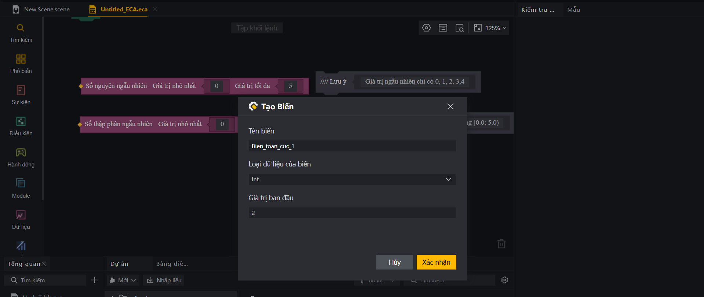

# Khai Báo Biến Và Kiểu Dữ Liệu Trong FCG

Trong lập trình game, biến (variables) đóng vai trò như các thùng chứa dữ liệu (ví dụ: chứa lượng HP của người chơi, số điểm tích lũy, hoặc trạng thái trận đấu). Để sử dụng biến hiệu quả trong FCG (Free Fire Craftland Game Scripting Language), cần nắm rõ hai phạm vi khai báo và các kiểu dữ liệu cơ bản.

---

## 1. Biến Cục Bộ (Local Variables)
Biến cục bộ được khai báo bên trong các hàm (`func`, `async func`) hoặc các sự kiện (`event`). Giá trị của chúng chỉ tồn tại trong suốt quá trình khối lệnh đó thực thi và sẽ bị giải phóng sau khi khối lệnh kết thúc.

### Cú pháp:
* **Tự động suy luận kiểu dữ liệu (Khuyên dùng):**
  ```fcg
  var tên_biến = giá_trị_khởi_tạo
  ```
* **Khai báo tường minh kiểu dữ liệu:**
  ```fcg
  var tên_biến kiểu_dữ_liệu = giá_trị_khởi_tạo
  ```

### Ví dụ:
```fcg
event OnGameStart() {
    var hp = 100.0                       // Tự động suy luận kiểu float
    var name string = "Player_A"        // Khai báo rõ kiểu string
    var isReady = false                  // Tự động suy luận kiểu bool
    
    LogInfo("Người chơi: " + name + " - HP: " + hp)
}
```

---

## 2. Biến Thành Viên (Graph Member Variables hay còn gọi là biến toàn cục)
Biến thành viên được khai báo trực tiếp bên trong khối `graph` (nhưng nằm ngoài các hàm/sự kiện). Dữ liệu của chúng được lưu trữ và duy trì trạng thái liên tục trong suốt vòng đời của thực thể gắn tập lệnh.

> [!IMPORTANT]
> **ĐIỂM KHÁC BIỆT CÚ PHÁP:**
> Khi khai báo biến thành viên của Graph, **không sử dụng** từ khóa `var` ở đầu dòng và **phải** chỉ định rõ kiểu dữ liệu.

### Cú pháp:
```fcg
graph Tên_Graph {
    TênBiếnThànhViên kiểu_dữ_liệu = giá_trị_khởi_tạo
}
```

### Ví dụ:
```fcg
graph GameRulesManager {
    // Các biến thành viên lưu trữ trạng thái trận đấu
    TotalPlayers int = 0
    IsGameActive bool = false
    SpawnPoint Vector3 = Vector3{0.0, 1.0, 0.0}

    event OnGameStart() {
        IsGameActive = true
        TotalPlayers = GetAllPlayers().Length() // Cập nhật biến thành viên
    }
}
```

*Hình ảnh minh họa hộp thoại Tạo Biến (biến toàn cục/biến thành viên) trong ECA:*


---

## 3. Các Kiểu Dữ Liệu Cơ Bản
FCG có hệ thống kiểu dữ liệu tĩnh mạnh mẽ để tối ưu hóa hiệu năng game:

| Kiểu dữ liệu | Mô tả | Ví dụ |
| :--- | :--- | :--- |
| `bool` | Kiểu logic (đúng/sai) | `true`, `false` |
| `int` | Số nguyên 32-bit | `10`, `-25` |
| `int64` | Số nguyên 64-bit | `9223372036854775807` |
| `float` | Số thực dấu phẩy động | `3.14`, `-0.5` |
| `string` | Chuỗi ký tự văn bản | `"Free Fire"`, `"Craftland"` |
| `Vector3` | Tọa độ hoặc vectơ 3D | `Vector3{x, y, z}` |
| `Quaternion` | Góc quay trong không gian 3D | `Quaternion{x, y, z, w}` |
| `entity<T>` | Tham chiếu thực thể (Player, LevelObject) | `player<Player>` |

## 4. Chuyển Đổi Và Ép Kiểu Dữ Liệu

Trong lập trình FCG, việc chuyển đổi dữ liệu được chia làm hai trường hợp rõ rệt tùy theo tính chất của kiểu dữ liệu:

### a) Chuyển đổi kiểu dữ liệu cơ bản (sử dụng thư viện `Convert`)
Đối với các kiểu dữ liệu cơ bản như `int`, `float`, `string`, hệ thống khuyến khích sử dụng các hàm chính thức trong thư viện `Convert.fcc` để đảm bảo độ chính xác cao nhất và tránh lỗi biên dịch.

```fcg
import "Convert.fcc" as convert

var numInt = 10
var numFloat = convert.IntToFloat(numInt) // Chuyển int sang float bằng hàm chính thức

var score = 95
LogInfo("Điểm số là: " + convert.ToString(score)) // Chuyển sang string để nối chuỗi
```

### b) Ép kiểu bằng từ khóa `as` (Type Casting cho kiểu tương đồng)
Từ khóa `as` được sử dụng để ép kiểu giữa các kiểu dữ liệu có cấu trúc tương thích hoặc tương đồng nhau trong hệ thống UGC Craftland.

* **Chuyển đổi giữa ID tài nguyên (AssetConfigID) và Số nguyên (`int`):**
  ```fcg
  var itemIdInt = targetItemID as int        // Chuyển ItemID sang int để tính toán
  var newItemID = 10001 as ItemID            // Ép kiểu ngược lại từ int sang ItemID
  ```

* **Chuyển đổi Enum sang Số nguyên:**
  ```fcg
  var spriteIndex = "My_IMG" as EResKeySprite // Lấy SpriteID theo Key
  ```

* **Ép kiểu từ dạng Object chung (`object`) sang kiểu cụ thể:**
  Dùng khi duyệt danh sách các Khóa (Keys) của Map (hàm `map.GetAllKeys` luôn trả về một danh sách `object`):
  ```fcg
  for index, key in map.GetAllKeys(playerScores) {
      var playerName = key as string          // Ép kiểu object về string để dùng làm khóa
      var score = playerScores[playerName]
  }
  ```

* **Ép kiểu định danh tài nguyên sang thực thể:**
  ```fcg
  var winnerView = EResSceneIsleLand.WinnerView as entity<LevelObject>
  ```

