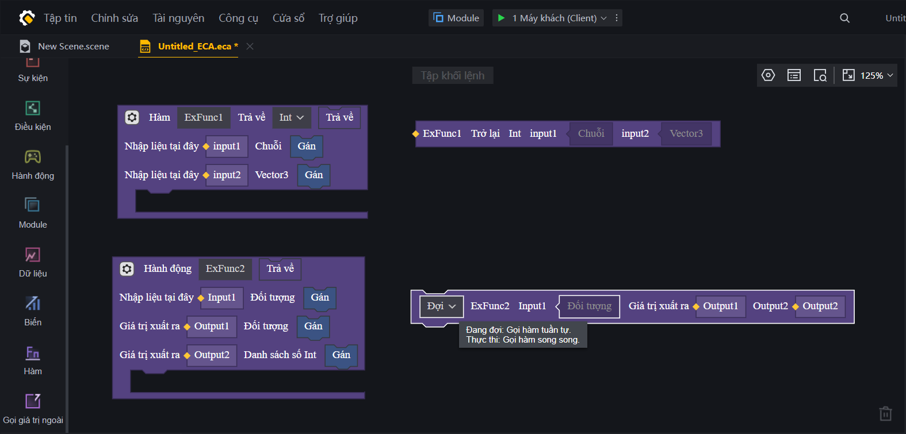

# Định Nghĩa Hàm (Functions) Trong FCG

Trong lập trình game, hàm (functions) giống như các chiêu thức hoặc kỹ năng tùy chỉnh của nhân vật. Việc gom các đoạn code lặp đi lặp lại vào trong các hàm giúp kịch bản game ngắn gọn, dễ quản lý và tối ưu hóa tốt hơn. 

FCG hỗ trợ hai loại hàm chính: **Hàm Thường (Normal Functions)** và **Hàm Bất Đồng Bộ (Async Functions)**.

---

## 1. Hàm Thường (Normal Functions)
Hàm thường dùng để xử lý các phép tính toán hoặc hành động tức thời mà không cần thời gian chờ (không có độ trễ).

### Cú pháp:
* **Hàm có giá trị trả về:**
  ```fcg
  func TênHàm(thamSố1 kiểu1, thamSố2 kiểu2) kiểuTrảVề {
      // Khối lệnh xử lý
      return giáTrị
  }
  ```
* **Hàm không có giá trị trả về (Void Function):**
  ```fcg
  func TênHàm(thamSố1 kiểu1) {
      // Khối lệnh xử lý
  }
  ```

### Ví dụ:
```fcg
// Hàm thường tính toán máu sau khi nhận giảm sát thương
func TinhMauThucTe(mauHienTai float, satThuong float, giap float) float {
    var satThuongGiam = satThuong - giap
    if satThuongGiam < 0.0 {
        satThuongGiam = 0.0
    }
    return mauHienTai - satThuongGiam
}
```

*Hình ảnh minh họa định nghĩa Hàm có giá trị trả về và Hàm không có giá trị trả về bao gồm các biến input (nhận giá trị) và biến output (xuất kết quả) trong ECA:*


---

## 2. Hàm Bất Đồng Bộ (Async Functions)
Trong game, rất nhiều hành động cần thời gian chờ (ví dụ: đếm ngược 5 giây trước khi mở cửa, hoặc gây sát thương mỗi 1 giây). Hàm thường **không thể** sử dụng các lệnh chờ như `WaitForMillisecond` hay `WaitForSecond`. Để làm việc này, ta phải sử dụng **Hàm Bất Đồng Bộ (`async func`)**.

### Cú pháp:
```fcg
async func TênHàmBấtĐồngBộ(thamSố kiểu) {
    // Cho phép gọi các hàm chờ thời gian
    WaitForMillisecond(2000) 
}
```

> [!WARNING]
> **KHÔNG ĐƯỢC PHÉP TRẢ VỀ GIÁ TRỊ TRỰC TIẾP (NO RETURN VALUE):**
> Trong FCG, hàm bất đồng bộ (`async func`) **không được phép** khai báo kiểu trả về ở tên hàm (ví dụ: `async func afunc() int` là sai) và **không được phép** sử dụng từ khóa `return` để trả về dữ liệu.
> 
> Nếu muốn truyền dữ liệu kết quả ra ngoài từ một hàm bất đồng bộ, người lập trình **bắt buộc** phải sử dụng tham số đầu ra (`out var`). Xem chi tiết ở Mục 3 dưới đây.

### Cách gọi Hàm Bất Đồng Bộ:
Hàm bất đồng bộ có hai cách gọi khác nhau bằng từ khóa `wait` hoặc `start`:

1. **Từ khóa `wait` (Chờ kết thúc):**
   Tạm dừng luồng chạy hiện tại để đợi hàm bất đồng bộ thực hiện xong rồi mới chạy tiếp dòng code bên dưới.
   ```fcg
   wait TenAsyncFunc()
   ```

2. **Từ khóa `start` (Chạy ngầm đa luồng/Coroutine):**
   Kích hoạt hàm bất đồng bộ chạy độc lập ở chế độ ngầm và lập tức thực thi dòng code tiếp theo mà không đợi hàm đó hoàn thành.
   ```fcg
   start TenAsyncFunc()
   ```

### Ví dụ:
```fcg
// Hàm bất đồng bộ thực hiện đếm ngược trận đấu
async func DemNguocTranDau(giay int) {
    for i = giay, 0, -1 {
        LogInfo("Trận đấu bắt đầu sau: " + (i as string))
        WaitForMillisecond(1000) // Chờ 1 giây
    }
    LogInfo("BẮT ĐẦU!")
}

event OnGameStart() {
    // Chờ đếm ngược xong mới chạy tiếp code bên dưới
    wait DemNguocTranDau(5)
    LogInfo("Game chính thức kích hoạt!")
}
```

---

## 3. Tham Số Đầu Ra (Out Parameters)
Ngoài giá trị trả về thông qua từ khóa `return` (chỉ trả về được 1 giá trị), FCG hỗ trợ cơ chế tham số đầu ra (`out var`) giúp hàm có thể trả về nhiều kết quả cùng lúc. Cơ chế này đặc biệt hữu dụng trong các hàm bất đồng bộ.

### Cú pháp:
```fcg
func TênHàm(thamSố kiểu, out var kếtQuả1 kiểu1, out var kếtQuả2 kiểu2) {
    kếtQuả1 = giáTrị1
    kếtQuả2 = giáTrị2
}
```

### Ví dụ:
```fcg
// Hàm kiểm tra trạng thái mua đồ
func KiemTraMuaDo(xuHienCo int, giaVatPham int, out var muaThanhCong bool, out var xuDu int) {
    if xuHienCo >= giaVatPham {
        muaThanhCong = true
        xuDu = xuHienCo - giaVatPham
    } else {
        muaThanhCong = false
        xuDu = xuHienCo
    }
}

event OnAwake() {
    KiemTraMuaDo(100, 40, out var thanhCong, out var du)
    if thanhCong {
        LogInfo("Mua đồ thành công! Số dư: " + (du as string))
    }
}
```

---

## 4. Ví Dụ Thực Tế Tổng Hợp
Ví dụ thực tế tổng hợp kết hợp giữa hàm thường, hàm bất đồng bộ chạy ngầm (`start`) và các kiểu dữ liệu đã được đưa về tệp mẫu:
* [PoisonGasManager.fcg](../FCG_Code_Template/PoisonGasManager.fcg)

