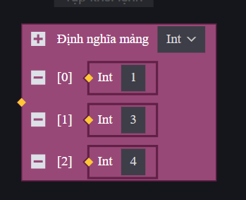
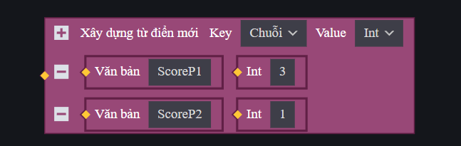

# Danh Sách (List) Và Bản Đồ (Map) Trong FCG

Trong lập trình game, chúng ta thường cần quản lý các tập hợp dữ liệu lớn, ví dụ: danh sách người chơi trong phòng đấu, số lượng vật phẩm trong túi đồ, hoặc bảng điểm của các đội. FCG cung cấp hai cấu trúc dữ liệu mạnh mẽ để làm việc này là **Danh Sách (List)** và **Bản Đồ (Map)**.

---

## 1. Danh Sách (List)
List là một cấu trúc dữ liệu dạng mảng tuyến tính, lưu trữ các phần tử có cùng kiểu dữ liệu theo một thứ tự chỉ mục (chỉ mục bắt đầu từ `0` đến `độ_dài - 1`).

### a) Khai báo và Khởi tạo
Để sử dụng các tính năng nâng cao của List, bắt buộc phải import thư viện danh sách ở đầu file:
```fcg
import "List.fcc" as list
```

Có hai cách khởi tạo một List:
* **Khởi tạo List rỗng định kiểu rõ ràng:**
  ```fcg
  var numbers List<int> = List<int>{} 
  ```
* **Khởi tạo bằng hàm của thư viện (xác định trước sức chứa):**
  ```fcg
  var players = list.New(0, 10) // Chiều dài ban đầu là 0, sức chứa tối đa ban đầu là 10
  ```

*Hình ảnh minh họa khối định nghĩa mảng số nguyên (Int Array) tương ứng trong ECA:*


### b) Duyệt danh sách (`for range`)
Sử dụng cấu trúc vòng lặp `for in` để duyệt qua từng phần tử trong List:
```fcg
var items List<string> = List<string>{}
// Giả sử items đã có dữ liệu...

for index, item in items {
    LogInfo("Vị trí " + (index as string) + " chứa vật phẩm: " + item)
}
```

### c) Các hàm thao tác thông dụng trên List
* **Thêm phần tử vào cuối danh sách:**
  ```fcg
  list.Append(numbers, 42)
  ```
* **Lấy số lượng phần tử hiện tại:**
  ```fcg
  var count = list.Length(numbers)
  ```
* **Xóa phần tử theo vị trí chỉ mục (index):**
  ```fcg
  list.RemoveAt(numbers, 0) // Xóa phần tử đầu tiên
  ```
* **Xóa phần tử theo giá trị:**
  ```fcg
  list.Remove(numbers, 42) // Tìm và xóa phần tử có giá trị là 42
  ```
* **Kiểm tra phần tử có tồn tại trong danh sách không:**
  ```fcg
  if list.Contain(numbers, 100) {
      LogInfo("Danh sách có chứa số 100")
  }
  ```
  *(Lưu ý: Không nên sử dụng hàm `Contains` vì đã bị đánh dấu lỗi thời).*
* **Tìm vị trí chỉ mục (index) của phần tử trong danh sách:**
  Hàm `IndexOf` trả về vị trí xuất hiện đầu tiên của phần tử (trả về `-1` nếu không tìm thấy). Hàm `LastIndexOf` trả về vị trí xuất hiện cuối cùng.
  ```fcg
  var firstPos = list.IndexOf(numbers, 42)  // Trả về vị trí của số 42 đầu tiên
  var lastPos = list.LastIndexOf(numbers, 42) // Trả về vị trí của số 42 cuối cùng
  ```
* **Xáo trộn ngẫu nhiên các phần tử (rất hữu dụng để random vòng chơi hoặc vật phẩm):**
  ```fcg
  list.Shuffle(numbers)
  ```
* **Sao chép danh sách sang một danh sách mới độc lập:**
  ```fcg
  var newList = list.Clone(numbers)
  ```
  *(Lưu ý quan trọng: Lệnh `Clone` bắt buộc phải viết kèm tiền tố thư viện `list.Clone` để hệ thống nhận diện đúng).*

---

## 2. Bản Đồ (Map)
Map (hay còn gọi là Dictionary/Bảng tra cứu) là một cấu trúc dữ liệu lưu trữ dưới dạng các cặp **Khóa - Giá trị (Key - Value)**. Mỗi khóa trong Map là duy nhất và được dùng để truy xuất nhanh chóng giá trị tương ứng.

### a) Khai báo và Khởi tạo
Để sử dụng các tính năng nâng cao của Map, ta import thư viện bản đồ ở đầu file:
```fcg
import "Map.fcc" as map
```

Có hai cách khởi tạo một Map:
* **Khởi tạo Map rỗng:**
  ```fcg
  var playerScores Map<string, int> = Map<string, int>{}
  ```
* **Khởi tạo Map có gán sẵn dữ liệu ban đầu (Cú pháp đặc biệt):**
  ```fcg
  var weaponDamage = Map<int, float>{1001: 45.5, 1002: 50.0, 1003: 35.2}
  ```

*Hình ảnh minh họa khối xây dựng từ điển mới (Map) tương ứng trong ECA:*


### b) Thêm, Sửa và Lấy dữ liệu
* **Thêm hoặc sửa giá trị của một khóa:**
  ```fcg
  playerScores["Player_A"] = 150 // Thêm mới hoặc cập nhật điểm của Player_A thành 150
  ```
* **Lấy giá trị thông qua khóa:**
  ```fcg
  var score = playerScores["Player_A"]
  ```

### c) Duyệt dữ liệu của Map
Trong FCG, chúng ta có thể duyệt trực tiếp qua tất cả các cặp Khóa (Key) và Giá trị (Value) của Map bằng cấu trúc `for in` mà không cần lấy danh sách khóa thủ công. Kiểu dữ liệu của biến chạy `key` và `value` sẽ được tự động suy luận tương ứng với kiểu định nghĩa của Map.

```fcg
for key, value in playerScores {
    // key tự động nhận kiểu string, value tự động nhận kiểu int
    LogInfo("Người chơi: " + key + " | Điểm số: " + (value as string))
}
```


### d) Các hàm thao tác thông dụng trên Map
* **Kiểm tra xem khóa có tồn tại trong Map hay không:**
  ```fcg
  if map.ContainKey(playerScores, "Player_B") {
      LogInfo("Player_B đã có điểm số")
  }
  ```
* **Lấy số lượng cặp Key-Value trong Map:**
  ```fcg
  var size = map.Length(playerScores)
  ```
* **Xóa một cặp Key-Value ra khỏi Map:**
  ```fcg
  map.Remove(playerScores, "Player_A")
  ```
* **Xóa sạch toàn bộ dữ liệu trong Map:**
  ```fcg
  map.Clear(playerScores)
  ```
