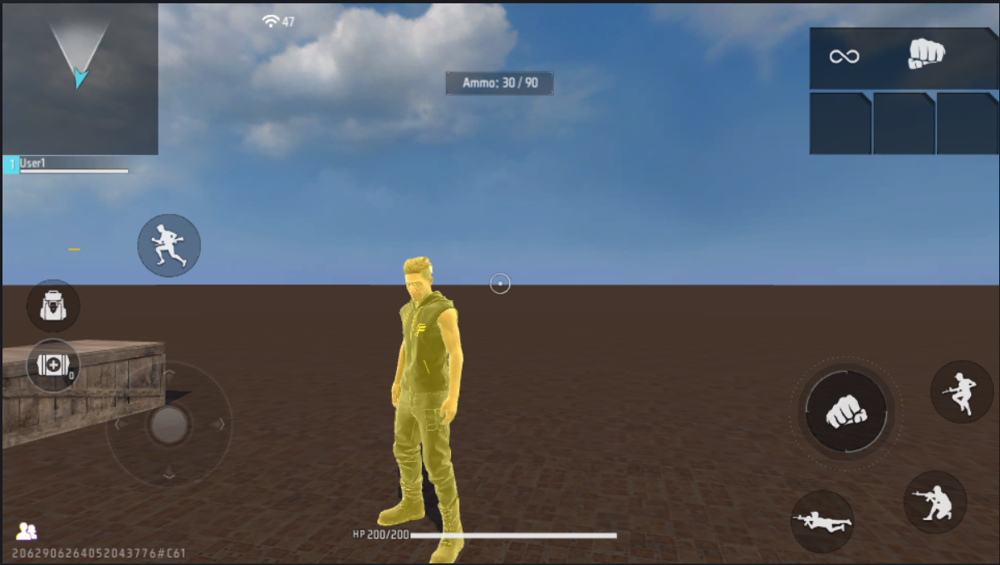

# Xử Lý Chuỗi Ký Tự (Strings) Trong FCG

Trong lập trình kịch bản game, chuỗi ký tự (string) được sử dụng liên tục để hiển thị thông báo UI, xuất nhật ký Console (log), xử lý tên người chơi, hoặc định dạng các đoạn văn bản động. FCG cung cấp các phép toán cơ bản và thư viện `strings` chuyên dụng để thao tác với chuỗi.

---

## 1. Khai Báo Và Nối Chuỗi Cơ Bản
* **Khai báo chuỗi:**
  ```fcg
  var title = "Đấu Trường Sinh Tồn"
  ```
* **Nối chuỗi bằng toán tử `+`:**
  Toán tử `+` được sử dụng để ghép các chuỗi lại với nhau.
  ```fcg
  var firstName = "Free"
  var lastName = "Fire"
  var fullName = firstName + " " + lastName // Kết quả: "Free Fire"
  ```
* **Chuyển đổi dữ liệu sang chuỗi (`convert.ToString`):**
  Khi muốn ghép một biến kiểu khác (như `int`, `float`, `bool`, `Vector3`,...) vào chuỗi, hệ thống khuyến khích import thư viện `Convert.fcc` để sử dụng hàm `ToString()` giúp chuyển đổi mọi kiểu dữ liệu sang chuỗi với độ chính xác cao.
  ```fcg
  import "Convert.fcc" as convert

  var name = "Player_A"
  var level = 5
  
  // Sử dụng convert.ToString để chuyển int sang string trước khi nối
  var logMsg = "Người chơi: " + name + " - Cấp độ: " + convert.ToString(level)
  ```

---

## 2. Thư Viện Xử Lý Chuỗi Nâng Cao
Để sử dụng các tính năng xử lý chuỗi nâng cao, cần import thư viện chuỗi ở đầu file:
```fcg
import "Strings.fcc" as strings
```

### a) Định dạng chuỗi nâng cao (`strings.FormatStr`)
Hàm `FormatStr` dùng để định dạng văn bản động bằng cách sử dụng các ký tự giữ chỗ `%v` (tương tự định dạng trong ngôn ngữ Go) kèm theo một danh sách tham số tương ứng.

* **Cú pháp:**
  ```fcg
  strings.FormatStr(nội_dung_định_dạng, danh_sách_tham_số)
  ```
* **Ví dụ:**
  ```fcg
  var name = "Gamer"
  var rank = 1
  
  // Định dạng chuỗi sử dụng danh sách tham số
  var message = strings.FormatStr("Chúc mừng %v đã đạt Top %v trong trận đấu!", List<object>{name, rank})
  LogInfo(message) // Kết quả: Chúc mừng Gamer đã đạt Top 1 trong trận đấu!
  ```
  *(Lưu ý: Không sử dụng hàm `Format` vì đã bị đánh dấu lỗi thời).*

### b) Các hàm thao tác chuỗi thông dụng
* **Lấy độ dài chuỗi (Số lượng ký tự):**
  ```fcg
  var len = strings.Length("Free Fire") // Trả về 9
  ```
* **Tìm kiếm chuỗi con (`strings.Find`):**
  Tìm vị trí đầu tiên xuất hiện của chuỗi con bắt đầu từ vị trí chỉ định. Trả về vị trí index (bắt đầu từ 0) hoặc `-1` nếu không tìm thấy.
  ```fcg
  var index = strings.Find("Free Fire Craftland", "Fire", 0) // Trả về 5
  ```
* **Cắt chuỗi con (`strings.Sub`):**
  Cắt một đoạn chuỗi từ vị trí chỉ định với độ dài mong muốn.
  ```fcg
  var subText = strings.Sub("Free Fire", 5, 4) // Trả về "Fire"
  ```
* **Thay thế chuỗi (`strings.Replace`):**
  Tìm kiếm và thay thế tất cả các chuỗi con bằng chuỗi mới.
  ```fcg
  var original = "Hello World"
  var result = strings.Replace(original, "World", "Craftland") // Trả về "Hello Craftland"
  ```
* **Tách chuỗi thành danh sách (`strings.Split`):**
  Cắt chuỗi gốc thành các phần nhỏ dựa trên ký tự ngăn cách và trả về một danh sách các chuỗi (`List<string>`).
  ```fcg
  var tags = "Kiem,Giap,Mu"
  var listTags = strings.Split(tags, ",") // Trả về List<string>{"Kiem", "Giap", "Mu"}
  ```
* **Gộp danh sách thành chuỗi (`strings.Join`):**
  Ghép các phần tử trong danh sách chuỗi lại với nhau bằng ký tự nối chỉ định.
  ```fcg
  var listWords = List<string>{"Free", "Fire"}
  var combined = strings.Join(listWords, " ") // Trả về "Free Fire"
  ```
* **Chuyển đổi viết hoa / viết thường:**
  ```fcg
  var upper = strings.ToUpper("craftland") // Trả về "CRAFTLAND"
  var lower = strings.ToLower("CRAFTLAND") // Trả về "craftland"
  ```
  *(Lưu ý: Không dùng hàm `Upper` và `Lower` vì đã bị đánh dấu lỗi thời).*
* **Cắt khoảng trắng thừa ở hai đầu chuỗi (`strings.Strip`):**
  ```fcg
  var cleanText = strings.Strip("   nội dung   ") // Trả về "nội dung"
  ```

---

## 3. Ví Dụ Thực Tế Tổng Hợp
Dưới đây là một Script hoàn chỉnh: Khi bắt đầu mỗi vòng đấu mới (Round Start), hệ thống lấy số lượng đạn hiện tại, chuyển đổi thành chuỗi, ghép chuỗi thông tin và hiển thị trực tiếp lên màn hình người chơi dưới dạng thông báo HUD Tips.

```fcg
import "StdLibrary.fcc" as std
import "Convert.fcc" as convert
import "Workflow.fcc" as workflow

[platform_server]
graph AmmoHUDManager {
    
    event OnRoundStart(roundIndex int) {
        var players = GetAllPlayers()
        for index, player in players {
            var clipAmmo = 30
            var totalAmmo = 90
            
            // Ghép chuỗi thông tin lượng đạn
            var ammoMsg = "Ammo: " + convert.ToString(clipAmmo) + " / " + convert.ToString(totalAmmo)
            
            // Hiển thị lên màn hình người chơi trong 3000ms (3 giây)
            NotifyShowTips(player, ammoMsg, #FFFFFFFF, 3000)
        }
    }
}
```

*Hình ảnh minh họa thông tin đạn hiển thị thực tế trên HUD của người chơi:*

