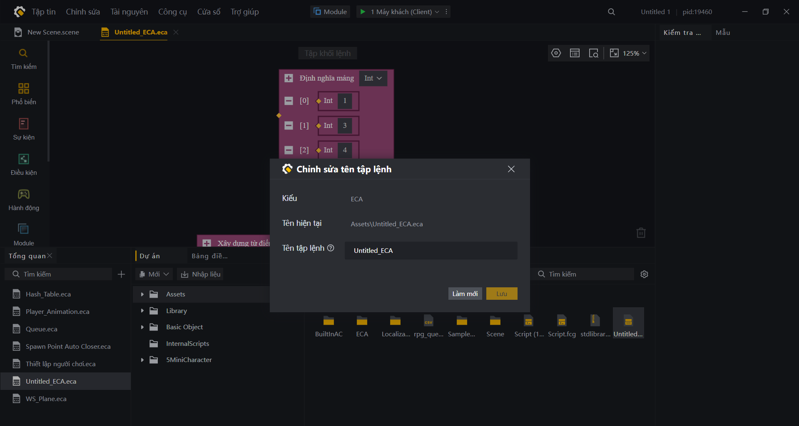

# Tích Hợp Và Sử Dụng Tập Lệnh ECA Trong FCG

Trong Craftland Studio, hệ thống **ECA (Event-Condition-Action)** và **FCG (Flow Code Generation)** có mối liên kết chặt chẽ. Việc này cho phép bạn tái sử dụng các logic trực quan được xây dựng từ ECA ngay bên trong tập lệnh dòng lệnh FCG.

Tài liệu này hướng dẫn cách import và gọi các hàm, biến từ tập lệnh ECA vào code FCG một cách chuẩn xác nhất.

---

## 1. Bản Chất Của Việc Liên Kết (Syntax Name & File ID)

Hệ thống FCG nhận diện các tệp ECA dựa vào **Syntax Name (Tên cú pháp)** được định nghĩa trong Editor của Craftland Studio, chứ không phụ thuộc vào tên tệp thực tế lưu trên đĩa.

* **Đặc tính tên cú pháp:** Cho dù tệp trên máy tính tên là `Player_Settings.eca`, nhưng nếu trong Editor bạn đặt tên cú pháp (Syntax Name) là `Hero_Control_ECA` thì trong code FCG bạn bắt buộc phải gọi theo tên `Hero_Control_ECA`. Dù có đổi tên tệp đĩa thế nào, miễn là Syntax Name giữ nguyên, code vẫn hoạt động bình thường.
* **Đặc tính File ID:** Khi chỉnh sửa các tệp trong project Craftland, hãy cẩn trọng với thuộc tính `fileID`. Đây là giá trị quyết định tệp tin đang trỏ đến tài nguyên nào trong project (đường dẫn tệp tin chỉ đóng vai trò phụ). Các tệp tin `.meta` tương ứng với tệp tin gốc sẽ chứa `fileID` cần tìm (ví dụ: `CH0001.eca.meta` chứa `fileID` của `CH0001.eca`).

> [!TIP]
> **Mẹo thao tác nhanh trong Editor:**
> * **Đổi tên tập lệnh:** Chọn tệp `.eca`, sau đó ấn tổ hợp phím **Alt + E** để thay đổi tên tập lệnh khi import vào FCG.
> * **Sao chép tên tập lệnh:** Ấn tổ hợp phím **Alt + C** để sao chép nhanh tên tập lệnh.

*Hình ảnh minh họa hộp thoại Chỉnh sửa tên tập lệnh (Syntax Name) khi chọn tệp ECA và nhấn Alt + E trong Editor:*


---

## 2. Cú Pháp Import Tập Lệnh ECA

Để sử dụng một tập lệnh ECA trong FCG, bạn cần thực hiện import tệp thư viện liên kết tự động phát sinh của hệ thống:

```fcg
import <Tên_cú_pháp_ECA> from "EditorGenLib.fcc"
```

* **Ví dụ:** Nếu tệp ECA cấu hình toàn bản đồ có tên cú pháp (Syntax Name) là `Toan_ban_do`, cú pháp import đúng sẽ là:
  ```fcg
  import Toan_ban_do from "EditorGenLib.fcc"
  ```
  *(Lưu ý: Tệp ECA phải được đặt tên cú pháp hợp lệ và không trùng lặp trước khi import để tránh lỗi).*

### Mẹo kiểm tra tên chính xác:
Để chắc chắn tên import không bị sai, bạn hãy mở tệp phát sinh tạm thời của hệ thống tại đường dẫn:
`Temp\UGCLanguage\editorGen\EditorGenLib.fcc`

Tìm dòng khai báo của tập lệnh tương ứng. Tên đứng ngay sau từ khóa `declare graph` chính là tên chính xác nhất bạn dùng để import.

---

## 3. Cách Sử Dụng và Gọi Logic ECA Qua Entity

Sau khi import thành công, bạn có thể truy cập các hàm hoặc biến của ECA thông qua thực thể (Entity) bằng cú pháp:

```fcg
thisEntity<Tên_ECA_Alias>.Tên_hàm_hoặc_biến_ECA()
```

* **Ví dụ:**
  Giả sử bạn có tập lệnh ECA quản lý người chơi với tên cú pháp là `Nguoi_choi_ECA`, trong đó có hàm `TangSucManh()`.
  
  ```fcg
  import Nguoi_choi_ECA from "EditorGenLib.fcc"

  function Run()
  {
      // Triệu hồi sức mạnh tăng chỉ số của người chơi hiện tại thông qua Entity
      thisEntity<Nguoi_choi_ECA>.TangSucManh()
  }
  ```

---

## 4. Các Quy Tắc Vàng Để Tránh Lỗi Biên Dịch

### a) Tránh trùng từ khóa hệ thống
Khi đặt tên cú pháp cho tập lệnh ECA trong Editor, tuyệt đối **không** đặt trùng với các từ khóa mặc định của hệ thống hoặc thư viện (như `Player` hoặc `Global`).
* *Khuyến nghị:* Hãy thêm hậu tố `_ECA` để dễ quản lý (Ví dụ: đặt tên là `Nguoi_choi_ECA` thay vì `Player`).

### b) Định nghĩa lại tên biến và tên hàm
Trong ECA, lập trình viên thường đặt tên hàm hoặc biến bằng tiếng Việt có dấu. Tuy nhiên, khi gọi trong FCG, các ký tự có dấu rất dễ gây lỗi cú pháp hoặc lỗi hiển thị.
* *Khuyến nghị:* Nên định nghĩa lại tên cú pháp (Syntax Name) cho tất cả biến và hàm trong ECA dưới dạng tiếng Anh hoặc tiếng Việt không dấu trước khi gọi trong FCG.

```fcg
// Cách khuyên dùng (Không dấu, rõ ràng):
thisEntity<Nguoi_choi_ECA>.TangTocDo()

// Tránh dùng (Dễ phát sinh lỗi biên dịch do ký tự đặc biệt):
thisEntity<Nguoi_choi_ECA>.Tăng_Tốc_Độ()
```
