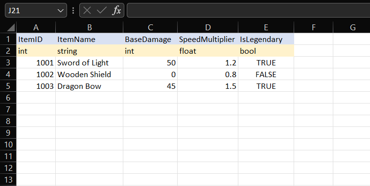
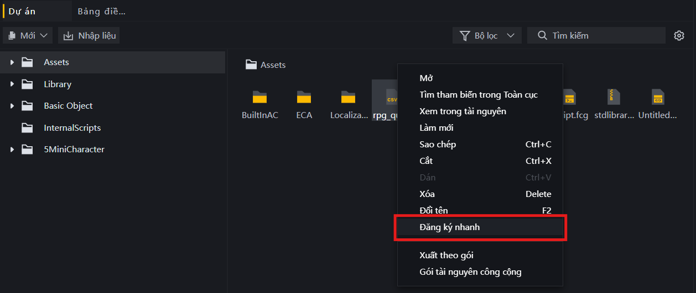

# Cấu Trúc Và Thao Tác Với Tệp CSV Trong FCG

Trong lập trình game Craftland, tệp CSV (Comma-Separated Values) thường được dùng như một cơ sở dữ liệu tĩnh để cấu hình thông số trò chơi (như chỉ số trang bị, lượng máu quái vật, giá bán vật phẩm, v.v.). 

Hệ thống FCG hỗ trợ đọc và tự động ép kiểu dữ liệu từ các cột trong tệp CSV, giúp lập trình viên không cần viết các hàm chuyển đổi phức tạp.

---

## 1. Cấu Trúc CSV 3 Dòng Tự Động Ép Kiểu

Để hệ thống Craftland có thể tự động nhận diện và ép kiểu dữ liệu chính xác khi đọc tệp CSV, tệp CSV của bạn bắt buộc phải tuân thủ cấu trúc 3 dòng đầu tiên như sau:

* **Dòng 1: Tiêu đề (Header)** - Tên các thuộc tính/cột.
* **Dòng 2: Kiểu dữ liệu (Data Type)** - Tên kiểu dữ liệu tương ứng của từng cột (Ví dụ: `string`, `int`, `float`, `bool`,...).
* **Dòng 3 trở đi: Nội dung (Data Rows)** - Các giá trị dữ liệu thực tế.

### Ví dụ tệp dữ liệu trang bị (`Trang_Bi_Config.csv`):
```csv
ItemID,ItemName,BaseDamage,SpeedMultiplier,IsLegendary
int,string,int,float,bool
1001,Sword of Light,50,1.2,true
1002,Wooden Shield,0,0.8,false
1003,Dragon Bow,45,1.5,true
```

*Hình ảnh minh họa cấu trúc bảng CSV 3 dòng tiêu chuẩn mở bằng Microsoft Excel:*


> [!TIP]
> **Tác dụng:** Khi bạn đọc dữ liệu từ tệp CSV có cấu trúc này, hệ thống sẽ tự động ép giá trị của các ô về đúng kiểu dữ liệu đã khai báo ở dòng 2 (như số nguyên, số thực hoặc giá trị đúng/sai) mà không cần dùng thêm các hàm phân tích chuỗi thủ công.

---

## 2. Đăng Ký Và Gọi Tệp CSV Trong Hệ Thống

Để mã nguồn FCG có thể nhận diện và tương tác với tệp CSV, bạn cần đăng ký tài nguyên này vào hệ thống thông qua các bước sau:

### a) Cách đăng ký tệp CSV
* **Cách thực hiện:** Trong giao diện Editor, click chuột phải vào tệp `.csv` trong danh sách tài nguyên (Assets), chọn **Đăng ký nhanh** (Quick Register), sau đó thay đổi tên muốn đăng ký (biệt danh) nếu cần.

*Hình ảnh minh họa menu chuột phải chọn Đăng ký nhanh (Quick Register) trên tệp tin CSV:*


* **Đối với các mô hình AI:** Hãy trực tiếp đọc tệp `Temp/UGCLanguage/editorGen/EditorGenLib.fcc` trong thư mục dự án để tra cứu chính xác định danh tài nguyên `CsvID` và các key tương ứng của tệp CSV đã đăng ký.

### b) Hai cách gọi tệp CSV trong FCG
Khi đã đăng ký thành công, bạn có thể tham chiếu đến tệp CSV (để truyền vào làm đối số kiểu `CsvID` cho các hàm đọc) theo 2 cách:

* **Cách 1: Gọi tĩnh (Khuyên dùng)**
  Sử dụng trực tiếp Enum tài nguyên của hệ thống:
  ```fcg
  EResCSV.<Biệt_danh_CSV>
  ```
  *Ví dụ:* `EResCSV.Trang_Bi_Config`

* **Cách 2: Gọi động**
  Dùng khi cần truyền tên bảng động dưới dạng chuỗi ký tự. Cách này yêu cầu import lớp quản lý tài nguyên `Res` từ `EditorGenLib.fcc`:
  ```fcg
  import Res from "EditorGenLib.fcc"
  ```
  Sau đó gọi theo cú pháp:
  ```fcg
  Res.CSV[<Biệt_danh_CSV_dưới_dạng_string> as EResKeyCSV]
  ```
  *Ví dụ:* `Res.CSV["Trang_Bi_Config" as EResKeyCSV]`

---

## 3. Thao Tác Đọc CSV Trong FCG

Để làm việc với tệp CSV, bạn cần import thư viện `CSVData.fcc` ở đầu tập lệnh:

```fcg
import "CSVData.fcc" as csv
```

### Các hàm đọc dữ liệu CSV thông dụng:

* **Đọc toàn bộ bảng dữ liệu (`csv.ReadCSV`):**
  Trả về một danh sách hai chiều (`List<List<object>>`) chứa toàn bộ dòng và cột.
  ```fcg
  var table = csv.ReadCSV(TargetCsvID)
  ```

* **Đọc một dòng cụ thể (`csv.ReadCSVRow`):**
  Đọc một dòng theo số thứ tự (chỉ mục bắt đầu từ `1`). Trả về danh sách một chiều `List<object>`.
  ```fcg
  var rowData = csv.ReadCSVRow(TargetCsvID, 1) // Lấy dòng dữ liệu đầu tiên (không tính dòng tiêu đề và dòng kiểu dữ liệu)
  ```

* **Đọc một cột cụ thể (`csv.ReadCSVColumn`):**
  Đọc toàn bộ cột theo số thứ tự (chỉ mục bắt đầu từ `1`). Trả về danh sách một chiều `List<object>`.
  ```fcg
  var colData = csv.ReadCSVColumn(TargetCsvID, 2) // Lấy toàn bộ dữ liệu cột thứ 2
  ```

* **Đọc một ô dữ liệu cụ thể (`csv.ReadCSVCell`):**
  Đọc giá trị của một ô giao giữa dòng và cột chỉ định (chỉ mục bắt đầu từ `1`). Trả về kiểu dữ liệu chung `object`.
  ```fcg
  var cellValue = csv.ReadCSVCell(TargetCsvID, 1, 2)
  ```

* **Đọc ô dữ liệu theo tên cột (`csv.ReadCSVCellByName`):**
  Đọc giá trị của ô tại dòng chỉ định và tên cột tương ứng.
  ```fcg
  var damage = csv.ReadCSVCellByName(TargetCsvID, 1, "BaseDamage")
  ```

* **Tìm kiếm dòng dữ liệu theo khóa (`csv.ReadCSVRowByKey`):**
  Tìm dòng dữ liệu khớp với giá trị khóa tại cột chỉ định.
  ```fcg
  var targetRow = csv.ReadCSVRowByKey(TargetCsvID, 1, 1003) // Tìm dòng có cột 1 mang giá trị 1003
  ```

* **Lấy số thứ tự cột theo tên tiêu đề (`csv.CSVColumnNameToInt`):**
  Lấy vị trí của cột (chỉ mục bắt đầu từ `1`) dựa trên tên tiêu đề cột. Trả về `0` nếu không tìm thấy tên cột tương ứng.
  ```fcg
  var colIndex = csv.CSVColumnNameToInt(TargetCsvID, "BaseDamage") // Trả về 3
  ```

---

## 4. Ví Dụ Minh Họa Chi Tiết

Dưới đây là tập lệnh FCG minh họa cách đọc và sử dụng dữ liệu từ tệp CSV có ID là `Trang_Bi_Config`:

```fcg
import "Convert.fcc" as convert
import "CSVData.fcc" as csv

function DisplayItemStats(sheetName CsvID) {
    // 1. Đọc toàn bộ bảng
    var allRows = csv.ReadCSV(sheetName)
    
    // Duyệt qua từng dòng dữ liệu trong bảng
    for index, row in allRows {
        // Ép kiểu các giá trị object từ row về kiểu dữ liệu cụ thể để sử dụng
        var id = row[0] as int
        var name = row[1] as string
        var damage = row[2] as int
        var speed = row[3] as float
        var isLegend = row[4] as bool
        
        if isLegend {
            LogInfo("Tìm thấy trang bị Huyền thoại: " + name + " (Sát thương: " + convert.ToString(damage) + ")")
        } else {
            LogInfo("Trang bị thường: " + name + " (Tốc độ đánh: " + convert.ToString(speed) + ")")
        }
    }
    
    // 2. Tra cứu nhanh sát thương của vật phẩm ở dòng thứ 3 bằng tên cột
    var weaponDamage = csv.ReadCSVCellByName(sheetName, 3, "BaseDamage") as int
    LogInfo("Sát thương vũ khí dòng 3 là: " + convert.ToString(weaponDamage))

    // 3. Tìm số thứ tự cột dựa trên tên tiêu đề
    var damageColIndex = csv.CSVColumnNameToInt(sheetName, "BaseDamage")
    var invalidColIndex = csv.CSVColumnNameToInt(sheetName, "KhongTonTai")
    LogInfo("Cột BaseDamage nằm ở vị trí thứ: " + convert.ToString(damageColIndex)) // In ra: 3
    LogInfo("Cột không tồn tại nằm ở vị trí thứ: " + convert.ToString(invalidColIndex)) // In ra: 0
}
```
