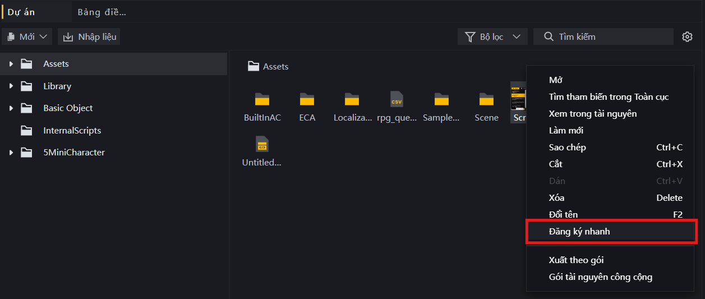
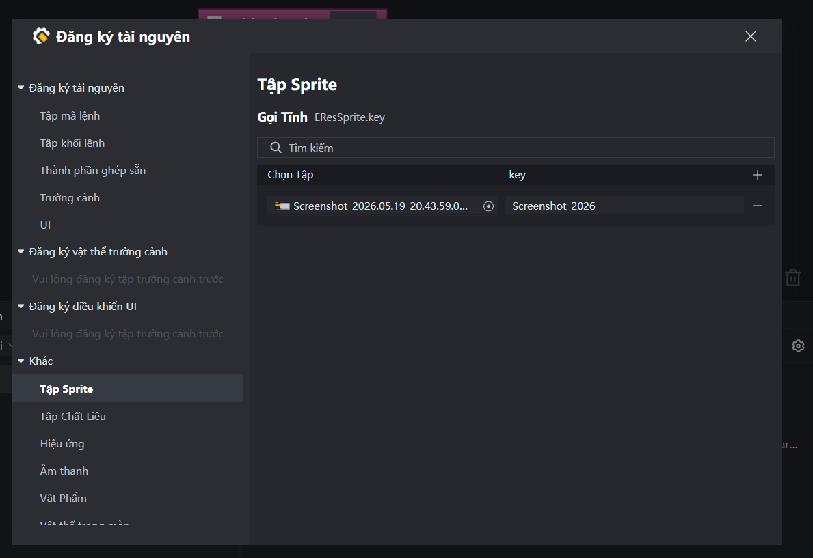

# Triệu Hồi Tài Nguyên Bằng Tính Năng Đăng Ký Nhanh (Quick Register)

Trong Craftland Studio, ngoài mã nguồn và tệp cấu hình, dự án còn bao gồm rất nhiều tệp tài nguyên bên ngoài (Assets) như hình ảnh (UI, biểu tượng), âm thanh (hiệu ứng âm thanh, nhạc nền), mô hình 3D, hiệu ứng đặc biệt (VFX),...

Để tập lệnh FCG có thể nhận diện, truy cập và điều khiển các tài nguyên này, bạn cần thực hiện đăng ký tài nguyên vào hệ thống.

---

## 1. Hướng Dẫn Đăng Ký Nhanh Tài Nguyên Trong Editor

Để đăng ký một tài nguyên mới vào dự án, hãy thực hiện theo các bước sau:

1. **Chọn tài nguyên:** Trong giao diện Editor của Craftland Studio, mở bảng tài nguyên (Assets) và tìm đến tệp tài nguyên cần đăng ký (Ví dụ: `My_Image.png` hoặc `My_Sound.wav`).
2. **Kích hoạt Đăng ký nhanh:** Click chuột phải vào file cần đăng ký trong bảng Assets và chọn **Đăng ký nhanh** (Quick Register).

*Hình ảnh minh họa menu chuột phải chọn Đăng ký nhanh (Quick Register) trên tệp tin hình ảnh/âm thanh:*

3. **Quản lý biệt danh (Key):** Hệ thống sẽ mở bảng quản lý **Register Asset**(Đăng ký tài nguyên) và tự động định vị tệp tin của bạn vào danh mục tương ứng ở cột trái (ví dụ: mục `Tập Sprite` đối với hình ảnh, `Âm thanh` đối với tiếng động,...).
4. **Thiết lập key:** Tại danh sách bên phải, tìm đến tên tệp tin vừa đăng ký và điền biệt danh mong muốn của bạn vào cột **key** (Ví dụ: `BG_Island_Scene`). Hệ thống sẽ tự động lưu và cập nhật định danh này vào dự án.

*Hình ảnh minh họa cửa sổ Đăng ký tài nguyên (Register Asset) hiển thị mục Tập Sprite và cột điền key:*


> [!NOTE]
> **Dành cho các mô hình AI:**
> Hãy trực tiếp đọc tệp `Temp/UGCLanguage/editorGen/EditorGenLib.fcc` trong thư mục dự án. Đây là nguồn dữ liệu duy nhất và chính xác nhất (chứa tất cả định danh tài nguyên, hình ảnh, âm thanh, hiệu ứng,...) được sinh tự động sau khi người chơi thực hiện Đăng ký nhanh trong Editor.

---

## 2. Hai Phương Phương Pháp Gọi Tài Nguyên Trong FCG

Sau khi đã đăng ký tài nguyên thành công, bạn có thể tham chiếu đến tài nguyên đó trong code FCG bằng hai cách dưới đây:

### a) Phương pháp Gọi Tĩnh (Static Call)
Đây là cách gọi trực tiếp thông qua các Enum tài nguyên tĩnh được hệ thống tự động phát sinh. Cách này an toàn và được trình biên dịch kiểm tra lỗi chính xác.
Tùy vào loại tài nguyên, hệ thống sẽ sử dụng các tiền tố tương ứng:
* `EResSprite` (Đối với hình ảnh / Sprite)
* `EResAudio` (Đối với âm thanh / Audio)
* `EResEffect` (Đối với hiệu ứng / VFX)
* `EResScene` (Đối với các vật thể trong scene)

**Cú pháp:**
```fcg
ERes<Loại_Tài_Nguyên>.<Biệt_danh_tài_nguyên>
```

**Ví dụ:**
```fcg
// Gọi tĩnh ảnh avatar mặc định
var avatar = EResSprite.Default_Avatar

// Phát âm thanh nạp đạn mặc định
PlayOneShotSound(EResAudio.Reload_Default, 1.0)
```

---

### b) Phương pháp Gọi Động (Dynamic Call)
Phương pháp này dùng khi muốn gọi tài nguyên dựa trên một chuỗi ký tự (String) nhận từ biến hoặc đọc từ cấu hình CSV tại thời điểm chạy game (Runtime).

Để sử dụng gọi động, bắt buộc phải import lớp quản lý tài nguyên `Res` từ `EditorGenLib.fcc`:

```fcg
import Res from "EditorGenLib.fcc"
```

**Cú pháp:**
```fcg
Res.<Loại_Tài_Nguyên>[<Chuỗi_Biệt_Danh> as EResKey<Loại_Tài_Nguyên>]
```
*(Bắt buộc sử dụng từ khóa `as` để ép kiểu chuỗi sang key enum tương ứng như `EResKeySprite`, `EResKeyAudio`, `EResKeyEffect`,...)*

**Ví dụ:**
```fcg
var soundName = "Skill_Fire_Sound"

// Gọi động âm thanh dựa trên giá trị của biến soundName
var dynamicAudio = Res.Audio[soundName as EResKeyAudio]
PlayOneShotSound(dynamicAudio, 1.0)
```

---

## 3. Ví Dụ Minh Họa Tổng Hợp

Tập lệnh FCG dưới đây kết hợp cả hai phương pháp gọi tĩnh và gọi động để tải hình ảnh và phát âm thanh tương ứng với từng loại vũ khí:

```fcg
import "Convert.fcc" as convert
import Res from "EditorGenLib.fcc"

// Hàm xử lý hiển thị và âm thanh cho vũ khí
function EquipWeaponEffects(weaponName string, iconName string) {
    // 1. Gọi Tĩnh: Phát âm thanh trang bị mặc định của hệ thống
    PlayOneShotSound(EResAudio.Default_Equip_Sound, 1.0)
    
    // 2. Gọi Động: Phát âm thanh đặc trưng của vũ khí truyền vào từ tham số
    // Ép kiểu chuỗi sang EResKeyAudio
    var weaponAudioKey = weaponName as EResKeyAudio
    var weaponAudio = Res.Audio[weaponAudioKey]
    PlayOneShotSound(weaponAudio, 1.0)
    
    // 3. Gọi Động: Lấy ảnh biểu tượng của vũ khí tương ứng
    // Ép kiểu chuỗi sang EResKeySprite
    var weaponSpriteKey = iconName as EResKeySprite
    var weaponIcon = Res.Sprite[weaponSpriteKey]
    
    LogInfo("Đã trang bị vũ khí: " + weaponName + " | Đã tải thành công ảnh biểu tượng.")
}
```
